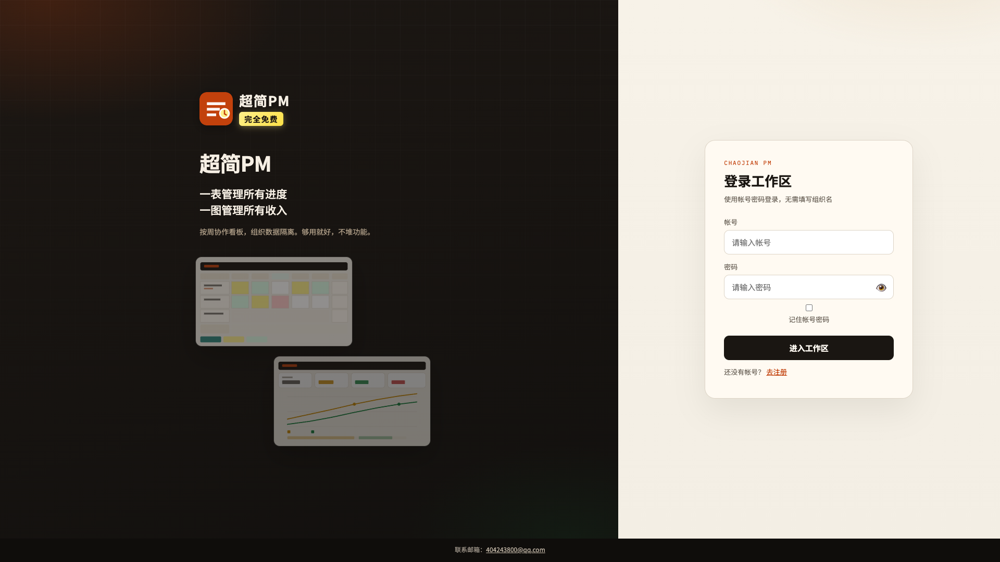
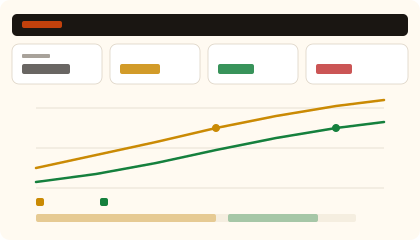

# 超简PM

**免费的团队日程协作 + 免费的销售管理。** 一台电脑就能部署，同事注册就能一起用。进度格子填完，一键把 Agent 接上，周报和提醒不用再人工催。

在线试用（免安装）：[schedule.peoplepark.com.cn](https://schedule.peoplepark.com.cn)

<p>
  
</p>
<p>
  
  
</p>

## 四个理由用它

### 1. 免费的团队日程协作管理

不是个人待办，是一张全员共用的周进度表。

- 分类 → 任务 → 自然周格子，三层结构一眼看完谁在干什么
- 点格子写「工作任务 / 完成内容 / 状态」：进行中、完成、受阻
- `@` 同事、指派任务，组织内数据隔离
- 「周工作汇总」把本周格子收成一篇给领导看的东西
- 注册即可：**新建组织**（你当管理员）或 **申请加入** 已有组织

聊天记录和 Excel 周报可以停了。格子就是现场。

### 2. 免费销售管理

同一套帐号，打开销售表就能用，不另收费、不另装系统。

- 预期、确认、回款，按周填
- 累计曲线一张图看完
- 和项目进度在同一组织里，销售跟交付不用两套工具对账

适合项目制小团队：一边盯交付，一边盯回款。

### 3. 快速部署，多人使用

没有微服务、没有强制云账号。Python 环境 + 一个命令。

```bash
python3 -m venv .venv
source .venv/bin/activate   # Windows: .venv\Scripts\activate
pip install -r requirements.txt
python app.py
```

打开 [http://127.0.0.1:5000](http://127.0.0.1:5000)，自己注册组织，把地址发给同事即可。局域网部署：

```bash
export CHAOJIAN_HOST=0.0.0.0
export CHAOJIAN_PORT=5000
python app.py
```

数据在本地 `data/`（已 `.gitignore`），组织与组织隔离，审批后才能加入。一个人先跑起来，十个人也能加进来。

### 4. 一键 Agent 提醒

内置 Agent API，不是演示开关。

1. 打开「Agent API」页，**复制提示词**发给你的 Agent（Cursor / Claude / 自建都行）
2. Agent 读懂接口后向你要 Key，再 **一键生成**（完整 Key 只出现一次）
3. Agent 就能拉本周任务、写完成内容、把状态改成完成

适合：下班前提醒自己还没填的格子、让 Agent 根据聊天记录回写进度、自动出周报草稿。普通用户只能写指派 / @ 给自己的任务；管理员可写本组织任务。

## 功能一览

| 模块 | 做什么 |
| --- | --- |
| 帐号与组织 | 注册、登录、新建组织、申请加入、管理员审批 |
| 进度看板 | 分类、任务、按周格子、@ 同事、状态色点 |
| 周报 | 周工作汇总、个人本周记录 |
| 销售 | 预期 / 确认 / 回款、累计曲线 |
| Agent | 提示词 + API Key，读写本周进度 |
| 管理 | 改组织名、加人、平台超管（可选环境变量） |

## 可选超管

不配环境变量就不会创建超管。自托管若需要平台后台：

```bash
export CHAOJIAN_SUPERADMIN_USER=your_admin
export CHAOJIAN_SUPERADMIN_PASSWORD=your_password
```

不要把真实密码写进仓库或提交到 Git。

## 技术

Python 3 + Flask + SQLite。单文件 `app.py`，静态资源在 `static/`，页面在 `templates/`。适合一台 NAS、一台办公电脑、或一台小云主机。

## 许可

源码按仓库现状公开：可自用、可改、可二次部署。免费给团队用。上线前请自己保管 `data/` 和超管环境变量。
